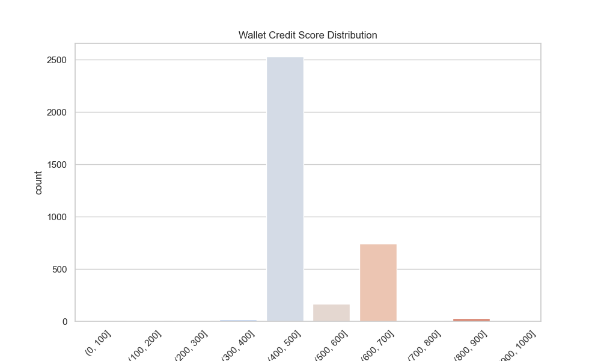

# Wallet Credit Score Analysis

This document presents a detailed analysis of the credit scores assigned to wallets interacting with the Aave V2 protocol, based on historical transaction-level data.

## Score Distribution

The wallets were scored on a scale of 0 to 1000. Below is the distribution of wallet scores grouped in bins of 100:

### Score Ranges:

* **0 - 100**: 0 wallets
* **101 - 200**: 3 wallets
* **201 - 300**: 3 wallets
* **301 - 400**: 15 wallets
* **401 - 500**: 2631 wallets
* **501 - 600**: 168 wallets
* **601 - 700**: 740 wallets
* **701 - 800**: 7 wallets
* **801 - 900**: 27 wallets
* **901 - 1000**: 2 wallets

---

## Analysis by Score Ranges

### 1. Wallets with Low Credit Scores (0–300):

* **Behavior:**

  * Frequent borrowing but minimal repayments.
  * Multiple short-term deposits/withdrawals.
  * Low net balance or abrupt inactivity after a few transactions.
* **Implication:** These wallets may represent higher-risk users and may require caution for protocol-incentivized rewards.

### 2. Wallets with Medium Credit Scores (301–700):

* **Behavior:**

  * Balanced activity across deposit and borrow.
  * Gradual growth in transaction volume and consistency.
  * Some usage of multiple DeFi protocols.
* **Implication:** These users show moderate risk and could be ideal for general protocol incentives or educational nudges.

### 3. Wallets with High Credit Scores (701–1000):

* **Behavior:**

  * Long-term participation with frequent deposits.
  * Low borrow ratios or timely repayments.
  * Diversified and stable usage behavior.
* **Implication:** Strong candidates for advanced DeFi opportunities, early access features, or higher rewards.

---

## Summary

The credit scoring model effectively highlights behavior patterns that can help Aave V2 or other protocols identify low-risk vs. high-risk wallets. This kind of segmentation can aid in:

* Designing reward structures
* Improving protocol safety
* Enabling more personalized DeFi experiences

**Note:** This analysis can be extended using clustering techniques, temporal analysis, or integrating cross-protocol activity for a more holistic scoring system.

---
