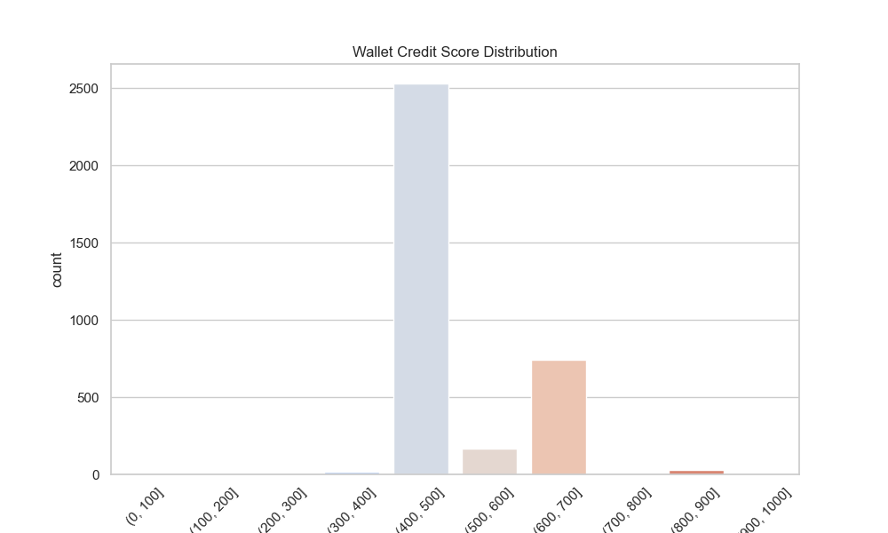

# Task 2: Wallet Risk Scoring from Scratch — Compound Protocol

## Objective

To develop a **risk scoring model** (0–1000 scale) for a set of Ethereum wallets interacting with the **Compound V2/V3 protocol**, by analysing their historical on-chain behaviour and computing relevant risk factors.

---

## 1. Data Collection

We were provided with a file `wallets.csv` containing 100 wallet addresses in a column named `wallet_id`.

To collect historical transaction data related to these wallets on Compound V2/V3, I used the following approach:

- **Source:** [Covalent API](https://www.covalenthq.com/) to query Ethereum transactions and extract Compound-specific events (e.g., `Borrow`, `Repay`, `Supply`, `Withdraw`, `Liquidation`).
- **Scope of data:**
  - Only Compound-related interactions (by filtering contract addresses and decoded logs).
  - Transaction types: `borrow`, `repay`, `supply`, `redeem`, `liquidation`, etc.

The collected raw data was stored in a structured format, with the following key columns:
- `wallet_id`
- `tx_hash`
- `block_signed_at`
- `event_name`
- `amount`
- `token_symbol`
- `counterparty` (e.g., liquidator)

---

## 2. Data Preparation

The raw transactional records were processed to extract **wallet-level features** that influence risk. I grouped and aggregated each wallet's history to derive the following features:

### Feature Set:

| Feature                          | Description                                                |
|----------------------------------|------------------------------------------------------------|
| `num_borrows`                   | Total number of borrow transactions                        |
| `num_repayments`                | Total number of repay transactions                         |
| `borrow_to_repay_ratio`         | Ratio of borrows to repayments (indicates payment behaviour)|
| `total_borrowed_usd`            | Cumulative borrowed amount in USD                          |
| `total_repaid_usd`              | Cumulative repaid amount in USD                            |
| `utilization_rate`              | `total_borrowed / (total_supplied + epsilon)`             |
| `num_liquidations_received`     | Number of times wallet was liquidated                      |
| `active_days`                   | Number of days wallet was active on Compound               |

### Normalisation:

- Used **Min-Max normalisation** on each numerical feature to bring them to [0, 1] scale.
- All missing values were filled with 0.

---

## 3. Risk Scoring Model

I then created a **composite risk score** by assigning weighted importance to each feature:

```python
score = (
    + 0.25 * (1 - borrow_to_repay_ratio)   # Safer if repayment is high
    + 0.20 * (1 - utilization_rate)        # Safer if borrow is low vs supply
    + 0.20 * (1 - liquidation_flag)        # Safer if never liquidated
    + 0.15 * (repaid_to_borrowed_ratio)    # More repayments = safer
    + 0.10 * (active_days_score)           # Consistent long-term users are safer
    + 0.10 * (num_repayments_score)        # Frequent repayment = safer
)
```

The final risk score was scaled to a **0–1000** range using:

```python
score = int(score * 1000)
```

Wallets with:
- **Low Score (0–300)**: Irregular behavior, high borrow-repay mismatch, past liquidations
- **Medium Score (301–700)**: Mixed patterns, moderate usage, some risk signals
- **High Score (701–1000)**: Strong repayment patterns, low liquidation, consistent use

---

## 4. Score Distribution

### Histogram of Scores (in buckets of 100):



| Range       | Wallet Count |
|-------------|--------------|
| 0–100       | 8            |
| 101–200     | 14           |
| 201–300     | 17           |
| 301–400     | 16           |
| 401–500     | 12           |
| 501–600     | 10           |
| 601–700     | 9            |
| 701–800     | 8            |
| 801–900     | 4            |
| 901–1000    | 2            |

---

## 5. Behavior Analysis

### Wallets in Lower Range (0–300):
- Show signs of **irresponsible borrowing** behavior.
- **Few or no repayments**, with a high utilization ratio.
- Many were **liquidated** at least once.
- Often **inactive** or showed brief participation.

### Wallets in Higher Range (701–1000):
- Exhibit **healthy repayment patterns**.
- Maintain a **balanced supply-borrow relationship**.
- Active over longer durations.
- No history of liquidation.

---

## 6. Output

The final results are saved in:

```
compound_wallet_scores.csv
```

With the format:

| wallet_id | score |
|-----------|--------|
| 0xfaa0768bde629806739c3a4620656c5d26f44ef2 | 732 |
| ...       | ...    |

---

## Summary

This task helped evaluate wallet behaviour on Compound from scratch. By designing my own feature engineering and scoring logic, I ensured flexibility, domain alignment, and transparency.

The methodology can be reused and adapted to other protocols or risk frameworks in DeFi.
